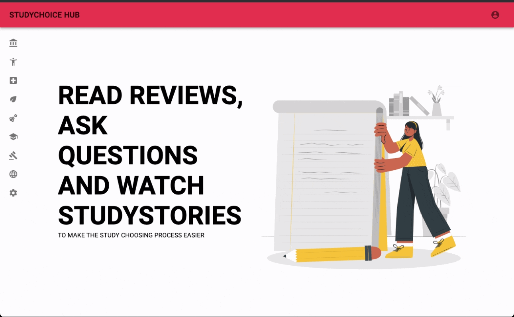
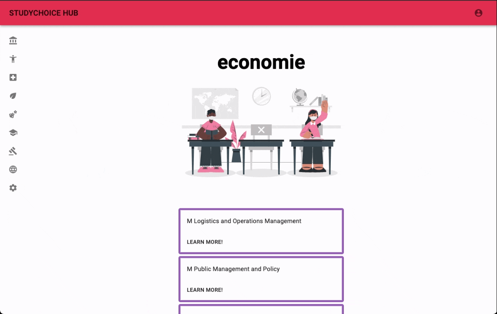

# STUDYCHOICEHUB - a social platform where students and scholars can connect

## What this app is about

Scholars are expected to make the choice of which direction they want to go with their future very early. Choosing a study is not easy and studying got more expensive when our government decided to stop the free study finance. 

I came up with this app to make the process of choosing a study easier. This app is a place where (ex) students can leave a review on their study, share stories (videos) to show their school or studying sessions and answer questions scholars have on studies.

### Used technologies and concepts

- React for UI building
- Redux for state management
- TypeScript
- Authentication
- Express
  - REST API
- Sequelize as ORM
- Cloudinary to upload video's

### Goals for this project

The goal of this project is to build a full stack app, practicing known and exploring new technologies. 
During the development of this app I learned TypeScript as a new tool independently by reading the documentation, consulting forums like StackOverflow and watching online (youtube)videos.

- Practice building a full-stack app
- Build a working prototype in 2 weeks
- Apply what we learned over the past 7 weeks the Codaisseur full stack bootcamp
- Extend knowledge of a new technology independently
- Showcase and document development skills using:
  - Wireframes
  - Data model
  - Writing user stories 
  - Kanban project approach
  - Transparant and structured Git version control

### User stories

- As a website visitor I am able to explore studies and see Reviews and Asked Questions and Answers
- As a website visitor I am able to create an account eighter as a student or as a scholar
- As a scholar I am able to post questions to different studies
- As a scholar I can view Studystories posted by Students
- As a student I am able to answer questions that were asked
- As a student I am able to upload a studystory eighter from my laptop or phone library or by using my phone's camera

I am planning to implement the following user stories 
- As a scholar I can save studies I like to my favorites
- As a user I can upload a profile picture
- As a user I can send Direct Messages to users if I want to ask a specific question about their experience

*This project is a work in progress. Some features still need to be implemented and revised. Any suggestions or feedback is welcome, please let me know! You can contact me [here](https://www.linkedin.com/in/carlijnvandeweijer/)*

### Project details
#### Github Project Board 

[Click here to see the Project Board](https://github.com/users/carlijnweijer/projects/2)

#### Wireframes

[Click here to see the wireframes](https://xd.adobe.com/view/cf13e627-2a4f-41aa-bc89-a8f9bd0a6ee1-9a40/grid/)

#### Database Diagram

[Click here to see the database diagram](https://dbdiagram.io/d/5fbb9fc23a78976d7b7d0aca)

#### Git version Control

I understand the need for solid version control and tried to 
- Write clear commit messages
- Use a development branch as main untill product is finished
- Name branches by feature
- Do pull requests after finishing a feature

### Backend repository

[Click here to see the backend repository](https://github.com/carlijnweijer/STUDYCHOICEHUB-backend)

